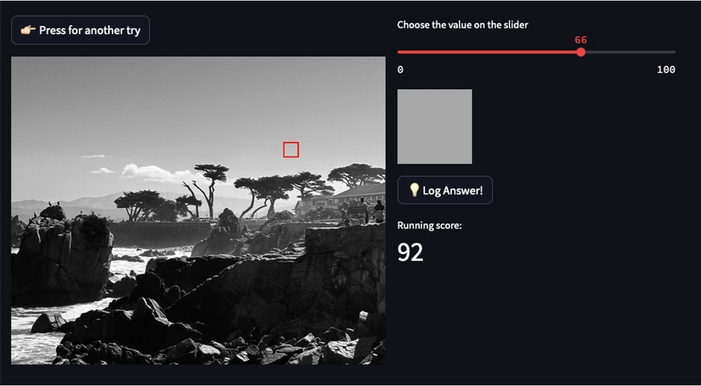

# 👁 Value Vision Training 👁

## _"Learning how to draw is learning how to see"_
👾Click to play: https://value-vision-trainer.streamlit.app/

Drawing realistically means mastering the skill of accurately capturing the **tonal value** of an object. Tonal values indicate light distribution on a surface, defining an object's shape and characteristics. If the tonal values are wrong, no amount of color can fix it!

Many aspiring artists struggle with accurately perceiving tonal values, which hinders their ability to translate what they see onto paper. Correcting these biases can take years, especially for self-taught artists without access to consistent feedback from a teacher.

👉🏻 I developed a program that gamifies tonal value training, akin to learning with flashcards. The user can upload any image they like into the program to train on. I created an algorithm that finds those areas in the image that are homogenous in value. You can read [here](https://m-guseva.github.io/portfolio/ImageAlgorithm/) if you're interested how the algorithm works exactly.

In each round a homogenous area in the image is selected selected (see box in the screenshot below) and the user is asked to match the tonal value with a slider, earning points based on accuracy. In this way the person gets quick feedback in the setting of an engaging game.

The Value Vision Trainer is built with Python using the Streamlit library for the interface. The program is deployed under [this link](https://value-vision-trainer.streamlit.app/), try it out! 😎

## Future plans
I plan to expand this concept to other aspects of art, such as hue matching, proportion training, and perspective. 
